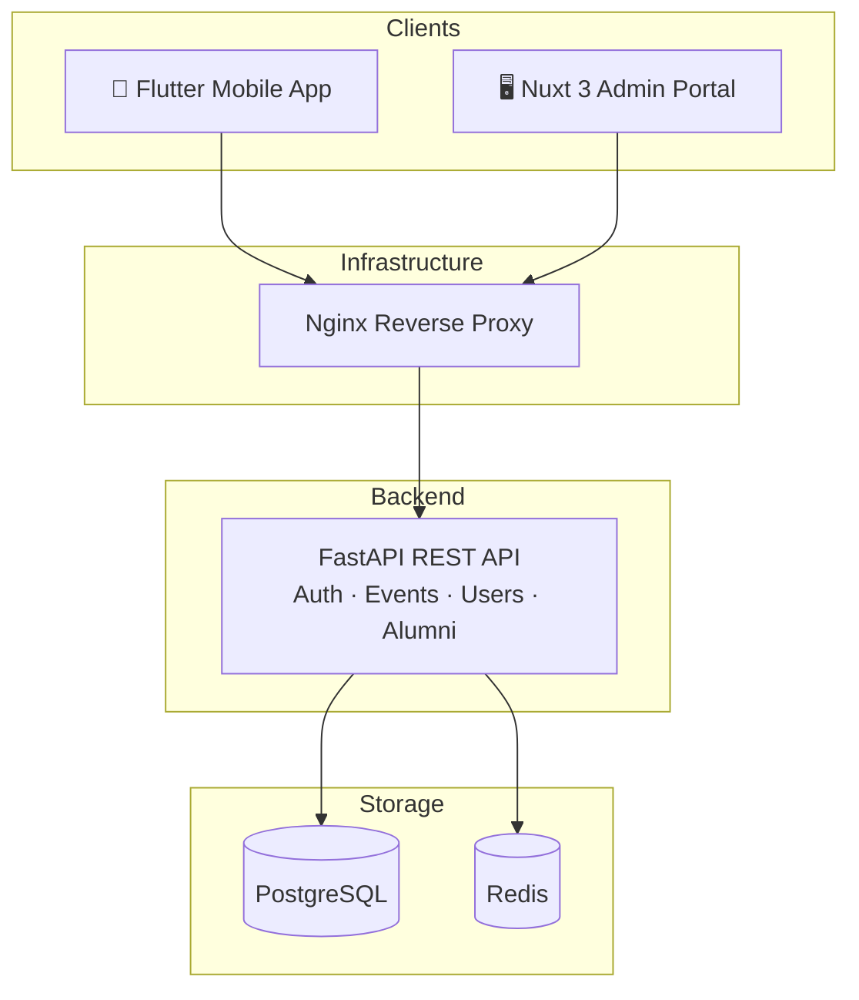

# 🎓 IU Alumni Platform

> A community platform for Innopolis University graduates — plan events, stay connected, and give back to the IU community.

---

## 🗂️ Repositories

| Repository | Description | Stack |
|------------|-------------|-------|
| [iu-alumni-backend](https://github.com/iu-alumni/iu-alumni-backend) | REST API & authentication | Python · FastAPI · PostgreSQL |
| [iu-alumni-frontend](https://github.com/iu-alumni/iu-alumni-frontend) | Admin portal web app | TypeScript · Nuxt 3 · Vue 3 |
| [iu-alumni-mobile](https://github.com/iu-alumni/iu-alumni-mobile) | Alumni mobile app | Dart · Flutter |
| [iu-alumni-infra](https://github.com/iu-alumni/iu-alumni-infra) | Infrastructure as code | Ansible · Terraform · Docker Swarm |
| [docs](https://github.com/iu-alumni/docs) | Technical & project documentation | VitePress |
| [privacy-policy](https://github.com/iu-alumni/privacy-policy) | Privacy policy for the mobile app | — |

---

## 🏗️ Architecture at a Glance

---

## 📚 Documentation

Full technical documentation (architecture, stack, diagrams, requirements, sprint notes) lives at:

**[iu-alumni.github.io/docs](https://iu-alumni.github.io/docs)**

---

## 🤝 Contributing

We welcome contributions from current and former IU students!

1. Read the [Contributing Guide](../CONTRIBUTING.md)
2. Follow the [Code of Conduct](../CODE_OF_CONDUCT.md)
3. Check open issues with the `good first issue` label in any repo

---

## 📬 Contact

- **Telegram community:** [t.me/+8hrAOuObPXQzZGRi](https://t.me/+8hrAOuObPXQzZGRi)
- **Issues & questions:** open an issue in the relevant repository

